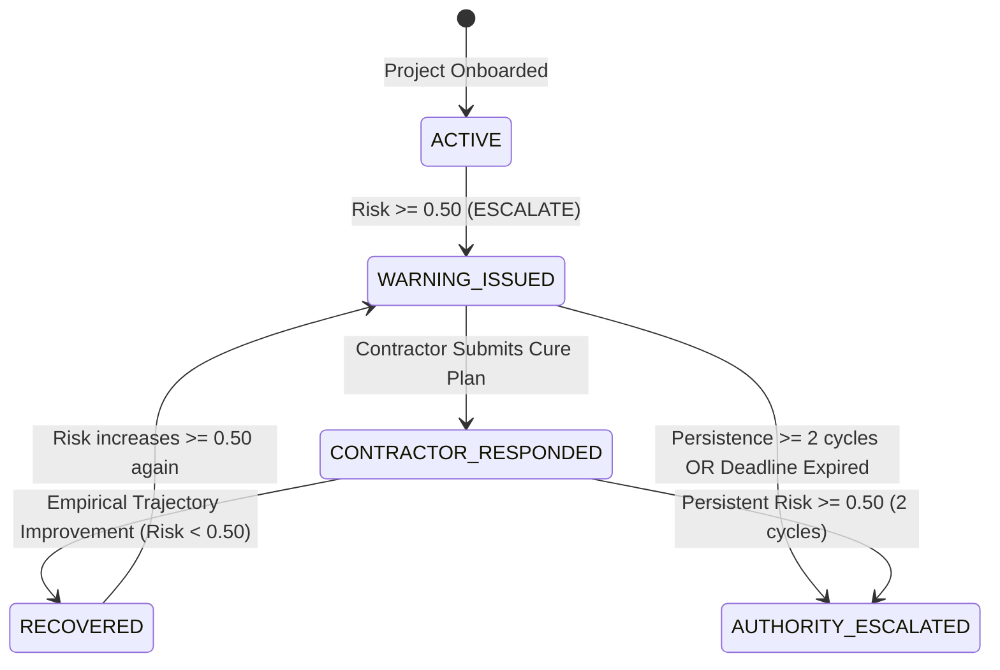

# SANKET Operational Monitoring Layer: Operational Workflow & Governance Specification

## 1. Overview & Product Architecture

The **SANKET Operational Monitoring Layer** translates SANKET's frozen machine-learning intelligence into a production monitoring, early-warning, and governance workflow for ongoing infrastructure projects.

In the operational workflow:
1. An infrastructure project is onboarded once.
2. The project authority submits actual monthly physical and financial progress reports.
3. SANKET reconstructs the project timeline and evaluates trajectory features strictly at the reporting point in time.
4. The frozen LightGBM model generates an early deterioration risk probability.
5. The **Governance Layer** operates downstream of the model:
   - High-risk signals trigger a formal **Contractor Warning**.
   - Contractors submit corrective action plans within a defined statutory window.
   - Subsequent monthly submissions monitor for demonstrable empirical recovery.
   - If severe risk persists across consecutive cycles without recovery, an **Authority Escalation** is issued to the supervisory ministry/nodal authority.

```
+-------------------------------------------------------------------------------+
|                             OPERATIONAL WORKFLOW                              |
|                                                                               |
|  [Project Registration]                                                       |
|           |                                                                   |
|           v                                                                   |
|  [Monthly Progress Upload (t)]                                                |
|           |                                                                   |
|           v                                                                   |
|  [Canonical Feature Pipeline]                                                 |
|     - Point-in-time timeline builder                                          |
|     - Trajectory & velocity engine                                            |
|     - Strict missingness preservation (no synthetic fabrication)              |
|           |                                                                   |
|           v                                                                   |
|  [Frozen LightGBM Predictive Engine]                                          |
|     - 12-month forward deterioration probability                              |
|     - Calibrated risk score                                                   |
|     - TreeSHAP factor attribution                                             |
|           |                                                                   |
|           v                                                                   |
|  [Governance State Machine]                                                   |
|     - NORMAL / WATCH / REVIEW / ESCALATE risk tier                            |
|     - Issue Contractor Warning (if risk >= 0.50 & status == ACTIVE)           |
|     - Track Contractor Response & Cure Commitments                            |
|     - Evaluate Empirical Recovery (measurable metric improvements)            |
|     - Issue Authority Escalation (if persistent >= 0.50 without cure)         |
|           |                                                                   |
|           v                                                                   |
|  [Append-Only Immutability Audit Ledger]                                      |
+-------------------------------------------------------------------------------+
```

---

## 2. Project Age vs. Observation Number Semantics

SANKET enforces strict differentiation between observation counters and actual project age:

1. **`observation_number` ($1, 2, 3\dots$)**:
   - Represents the sequential monthly submission index under SANKET operational surveillance.
   - Month 1 is always $1$, Month 2 is $2$, and so on.
   - Determines trajectory evidence availability ($V_{\text{fin}}$, $A_{\text{fin}}$).

2. **`project_age_months`**:
   - Computed as: $\text{reporting\_month} - \text{actual project\_start\_date}$.
   - Reflects the real chronological age of the capital asset since work commenced.
   - **Missingness Invariant**: If `project_start_date` is unknown or omitted, `project_age_months` is recorded explicitly as missing (`np.nan` / `null`). It is **never** fabricated or defaulted to 0.

---

## 3. Progressive History & Evidence Sufficiency

Evidence sufficiency is categorized by an objective evidence rating rather than a statistical confidence interval:

| Observations ($N$) | Rating / Label | Trajectory Status | Feature Capabilities Available |
| :--- | :--- | :--- | :--- |
| **1 observation** | `LOW_HISTORY` | `INSUFFICIENT_HISTORY` | Current-state metrics only ($C_{\text{base}}$, expenditure ratio, schedule delay). Velocity & acceleration are missing. |
| **2 observations** | `LIMITED_HISTORY` | `SUFFICIENT_HISTORY` | First-order velocity metrics ($V_{\text{fin}}$, $V_{\text{phy}}$). Acceleration is missing. |
| **3 to 5 observations** | `DEVELOPING_HISTORY` | `SUFFICIENT_HISTORY` | Full trajectory metrics: velocity, acceleration ($A_{\text{fin}}$, $A_{\text{phy}}$), short-term momentum. |
| **6+ observations** | `ESTABLISHED_HISTORY` | `SUFFICIENT_HISTORY` | Multi-quarter trend dynamics, peer-relative velocity ratios, burn rate stability. |

### Handling Single-Observation Projects
A newly onboarded project with only one monthly observation generates a valid deterioration probability from static baseline and current-state features (e.g., sanction scale, cumulative expenditure, baseline schedule delay). The response explicitly designates:
- `trajectory_status: "INSUFFICIENT_HISTORY"`
- `history_confidence: "LOW_HISTORY"`

---

## 4. Single Production Feature Pipeline Invariant

To guarantee absolute parity between historical backtesting, replay audits, and operational real-time monitoring, both pipelines invoke the exact same feature engineering entrypoint:

```
same project history through month t
        ↓
compute_canonical_features_for_project()
        ↓
same canonical feature vector (25 features)
        ↓
same preprocessing & imputation rules
        ↓
same frozen LightGBM model
        ↓
same calibration function
        ↓
identical prediction
```

### Point-in-Time Invariance Guarantee
For every operational observation at month $t$:
$$\text{prediction}(t) = f(\text{observations}_{1\dots t})$$
Adding, modifying, or deleting any subsequent observations (e.g. at month $t+1, t+2$) has **zero effect** on the historical feature vector or model prediction evaluated at month $t$.

---

## 5. Governance Architecture & Separation of Concerns

SANKET enforces strict structural decoupling between the statistical model and executive governance:

```
+-------------------------------------------------------------+
|                     MACHINE LEARNING MODEL                  |
|  - Predicts deterioration probability: P(deterioration)    |
|  - Evaluates TreeSHAP factor attributions                  |
|  - Strictly read-only; has no authority over legal status   |
+-------------------------------------------------------------+
                              |
                              v
+-------------------------------------------------------------+
|                    GOVERNANCE STATE MACHINE                 |
|  - Manages operational lifecycle states                     |
|  - Triggers Contractor Warning                             |
|  - Validates Contractor Cure Commitments                    |
|  - Monitors Empirical Recovery                              |
|  - Escalates to Ministry / High-Level Authority             |
|  - CAN NEVER alter model probabilities                      |
+-------------------------------------------------------------+
```

### Risk Tier Thresholds
Operating thresholds are frozen across all SANKET modules:
- **`NORMAL`**: $\text{Risk} < 0.40$
- **`WATCH`**: $0.40 \le \text{Risk} < 0.45$
- **`REVIEW`**: $0.45 \le \text{Risk} < 0.50$
- **`ESCALATE`**: $\text{Risk} \ge 0.50$

---

## 6. Contractor Warning & Authority Escalation Lifecycle



### 1. Contractor Warning
- **Trigger**: Model risk probability reaches or exceeds $0.50$ (`ESCALATE`) on an `ACTIVE` project.
- **Payload**: Includes target risk probability, top 3 TreeSHAP risk factors, current schedule delay, and required response deadline (default: 30 days).
- **Project State**: Transitions from `ACTIVE` to `WARNING_ISSUED`.

### 2. Contractor Response
- The executing agency/contractor logs a formal response containing:
  - Explanation of delays / cost deviations.
  - Corrective action milestones and planned catch-up spend.
  - Revised completion target.
- **Project State**: Transitions from `WARNING_ISSUED` to `CONTRACTOR_RESPONDED`.

### 3. Empirical Recovery Verification
A project is not declared recovered simply because an algorithm score drops. SANKET mandates **empirical verification**:
- Risk probability must drop below the escalation threshold ($< 0.50$).
- **Measurable improvement** must be demonstrated in at least one objective trajectory dimension:
  1. Positive expenditure acceleration ($A_{\text{fin}} > 0$).
  2. Positive progress velocity ($V_{\text{fin}} > 0$).
  3. Reduction in cumulative schedule delay ($\Delta \text{delay} \le 0$).
  4. Measurable decrease in Trajectory Risk Score.
- If trajectory evidence is absent, SANKET reports `recovery_status = "INSUFFICIENT_EVIDENCE"` rather than fabricating a recovery state.

### 4. Authority Escalation
- **Trigger**: Severe deterioration persists for **2 consecutive monthly reporting cycles** with risk $\ge 0.50$ after warning issuance without empirical recovery, OR contractor fails to respond by the statutory deadline.
- **Recipient**: Supervisory Ministry / High-Level Authority (e.g., MoSPI / Line Ministry Oversight Committee).
- **Action**: Generates an actionable dossier detailing persistence duration, capital exposure at risk, and failure to meet corrective commitments.
- **Configurability**: Default threshold is 2 cycles; configurable via operational governance policy.

---

## 7. Append-Only Immutability Audit Ledger

All operational lifecycle transitions, model predictions, warning issuances, contractor responses, and governance escalations are written to an append-only audit table:

- Every event receives a unique `event_id`, high-precision timestamp, and actor attribution.
- Record updates are prohibited; retroactive corrections or re-submissions append a new audit entry referencing the prior state.
- Enables forensic reconstruction of when risks were identified and who took what actions.

---

## 8. Database Schema & Storage Specifications

SANKET stores operational monitoring data in `DATA/monitoring.db` (SQLite):

```sql
-- Monitored projects master
CREATE TABLE monitored_projects (
    project_id TEXT PRIMARY KEY,
    project_name TEXT NOT NULL,
    sector TEXT NOT NULL,
    ministry TEXT,
    state TEXT,
    sanctioned_cost REAL NOT NULL,
    revised_cost REAL,
    planned_start_date TEXT,
    original_completion_date TEXT,
    current_status TEXT NOT NULL DEFAULT 'ACTIVE',
    warning_consecutive_count INTEGER NOT NULL DEFAULT 0,
    created_at TEXT NOT NULL,
    updated_at TEXT NOT NULL
);

-- Monthly progress submissions
CREATE TABLE monthly_observations (
    id INTEGER PRIMARY KEY AUTOINCREMENT,
    project_id TEXT NOT NULL,
    reporting_month TEXT NOT NULL,
    observation_number INTEGER NOT NULL,
    project_age_months REAL,
    cumulative_expenditure REAL NOT NULL,
    revised_cost REAL,
    expected_completion_date TEXT,
    physical_progress REAL,
    pred_prob REAL NOT NULL,
    risk_tier TEXT NOT NULL,
    trajectory_status TEXT NOT NULL,
    history_confidence TEXT NOT NULL,
    top_factors_json TEXT NOT NULL,
    feature_snapshot_json TEXT NOT NULL,
    created_at TEXT NOT NULL,
    UNIQUE(project_id, reporting_month)
);

-- Contractor warnings
CREATE TABLE contractor_warnings (
    warning_id TEXT PRIMARY KEY,
    project_id TEXT NOT NULL,
    reporting_month TEXT NOT NULL,
    pred_prob REAL NOT NULL,
    risk_tier TEXT NOT NULL,
    trigger_reason TEXT NOT NULL,
    response_deadline TEXT NOT NULL,
    status TEXT NOT NULL DEFAULT 'ISSUED',
    issued_at TEXT NOT NULL
);

-- Contractor responses
CREATE TABLE contractor_responses (
    response_id TEXT PRIMARY KEY,
    warning_id TEXT NOT NULL,
    project_id TEXT NOT NULL,
    explanation TEXT NOT NULL,
    corrective_action TEXT NOT NULL,
    commitments_json TEXT,
    submitted_by TEXT NOT NULL,
    submitted_at TEXT NOT NULL
);

-- High-level authority escalations
CREATE TABLE authority_escalations (
    escalation_id TEXT PRIMARY KEY,
    project_id TEXT NOT NULL,
    reporting_month TEXT NOT NULL,
    pred_prob REAL NOT NULL,
    persistence_cycles INTEGER NOT NULL,
    reason TEXT NOT NULL,
    escalated_to TEXT NOT NULL,
    escalated_at TEXT NOT NULL
);

-- Immutable audit trail
CREATE TABLE audit_events (
    event_id TEXT PRIMARY KEY,
    project_id TEXT NOT NULL,
    event_type TEXT NOT NULL,
    payload_json TEXT NOT NULL,
    performed_by TEXT NOT NULL,
    timestamp TEXT NOT NULL
);
```

---

## 9. REST API Reference

All monitoring endpoints are mounted under `/api/monitor`:

| Method | Endpoint | Description |
| :--- | :--- | :--- |
| `POST` | `/api/monitor/projects` | Onboard a new infrastructure project into SANKET surveillance |
| `GET` | `/api/monitor/projects` | List all monitored projects with latest risk tier and governance status |
| `GET` | `/api/monitor/projects/{id}` | Retrieve project details, latest observation, and active warning/escalation state |
| `POST` | `/api/monitor/projects/{id}/observations` | Submit monthly progress report and generate point-in-time prediction |
| `GET` | `/api/monitor/projects/{id}/observations` | Retrieve complete longitudinal history of monthly submissions |
| `GET` | `/api/monitor/projects/{id}/warnings` | Retrieve all contractor warnings issued for the project |
| `POST` | `/api/monitor/projects/{id}/warnings/{wid}/response` | Log contractor explanation, recovery plan, and cure commitments |
| `GET` | `/api/monitor/escalations` | List all high-level authority escalations across the monitored portfolio |
| `GET` | `/api/monitor/projects/{id}/audit` | Export the complete immutable append-only audit trail for compliance |

---

## 10. Regulatory & Legal Disclaimer

> [!IMPORTANT]
> **SANKET is an early-warning risk forecasting and decision-support system, NOT a statutory legal tribunal.**
> 
> - **Predictive Intelligence Only**: Model probabilities denote empirical statistical risk of future cost overrun or commissioning delays based on longitudinal trajectory patterns.
> - **No Deterministic Liability**: Issuance of a Contractor Warning or Authority Escalation does not constitute a legal finding of contractual default or negligence.
> - **Operational Policy**: Warning and escalation persistence rules represent administrative decision thresholds designed to optimize intervention lead time for project monitoring authorities.
